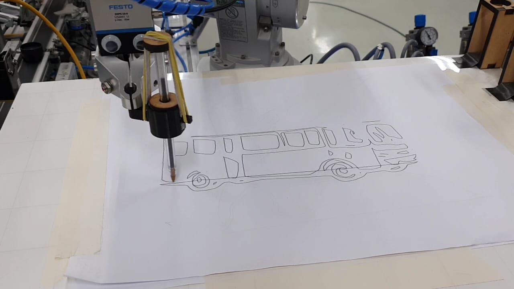
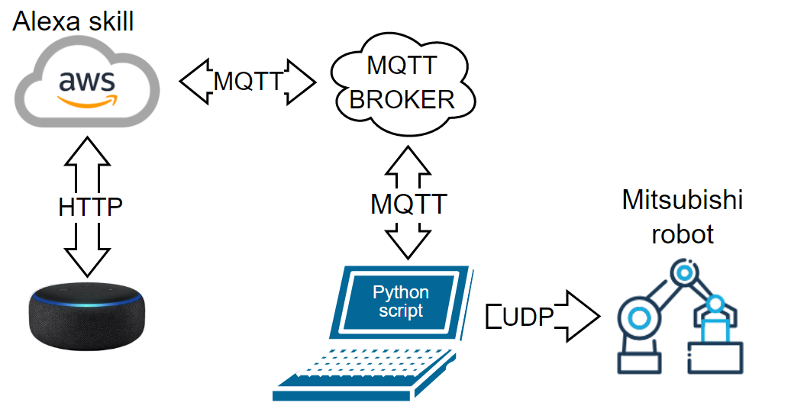

# Robô industrial desenhista + alexa

O intuito desse projeto, é permitir que um robô consiga desenhar uma imagem gerada por IA a partir de um comando de voz dado a Alexa. A sacada é justamente não saber o que ele vai desenhar, visto que o input falado a Alexa é recebido nesse projeto, utilizado para gerar uma imagem via API do DALL-E 2 e a imagem é tratada e enviada ao robô, sem que o usuário veja o que foi gerado. 


# Índice 
* [Topologia da integração](#Topologia-da-integração-completa)
* [Funcionamento](#Funcionamento)
* [Rodando a aplicação](#Rodando-a-aplicação)
* &nbsp; [Requerimentos](#Requerimentos)
* &nbsp; [Configurando ambiente](#Configurando-ambiente)
* &nbsp; [configurando .env](#configurando-.env)
* &nbsp; [Configurando posição inicial do robô](#Configurando-posição-inicial-do-robô)
* &nbsp; [Iniciando](#Iniciando)
* &nbsp; [Testando](#Testando)


# Topologia da integração completa 



OBS: Esse repositório se trata apenas do algoritmo que recebe o input via mqtt, gera a imagem e envia ao robô. A skill desenvolvida para a Alexa ainda não foi disponibilizada.

# Funcionamento
1. Recebe input via MQTT(no tópico especificado no .env)
2. Traduz o texto recebido para inglês (Isso é necessário, pois o DALL-E 2 só aceita prompts em inglês)
3. Faz request para API do DALL-E 2 e adiciona ao prompt a frase "one line, black nd white". Isso é necessário, pois o robô só pode desenhar imagens simples, já que utiliza apenas uma caneta.  Pedir ao DALL-E para gerar uma imagem preta e branca e em apenas uma linha é uma forma de se aproximar do resultado esperado.
4. Trata a imagem recebida, detectando bordas e vetorizando a mesma.
5. Gera o código em MBV (Melfa Basic V) em cima das posições em pixel de cada ponto da imagem vetorizada.
6. Envia e roda o código no robô.

# Rodando a aplicação
 ## Requerimentos
 - Python 3.7
 - Robô mitsubishi (A integração desenvolvida é voltada para essa marca de robôs)
 
 ## Configurando ambiente
 - Criando a venv:
 ```
python -m venv nome
 ```
 - Rodar venv:
 ```
.\nome\Scripts\activate      
 ```
 - Instalar pacotes:
 ```
pip install -r requirements.txt     
 ```
## configurando .env
- Faça uma cópia do arquivo .env.example e renomeie para apenas .env
- Preencha com as informações para utilização do MQTT (pode ser utilizado um broker publico).
```
BROKER_MQTT=
PORT_MQTT=1883
TOPIC_MQTT=
USERNAME_MQTT=
PASSWORD_MQTT=
```
- Gere uma API KEy do DALL-E: https://platform.openai.com/account/api-keys
- OBS: Existe uma cobrança de $0.016 por imagem gerada.
```
APIKEY_DALLE=
```
- IP do controlador do robô na rede em que o computador está conectado
```
ROBOT_IP=
```
## Configurando posição inicial do robô

No início do arquivo `main.py`, será encontrado uma lista chamada `referencePosition`. Essa lista é referente a posição onde a caneta toca o papel no ponto superior esquerdo da folha, como pode ser visto na imagem a cima. Substitua os valores zerados pela posição X, Y e Z desse ponto (as posições A, B e C, referentes ao angulo, já são setadas por padrão `-180.00,+0.00,-180.00`). Veja a baixo o trecho de código onde essa posição é declarada:
```
                    #X   Y   Z
referencePosition = [0 , 0 , 0] #Ponto de referencia para confecção do código
```  
## Iniciando
Para rodar o código, na raiz do projeto, dê o comando:
```
python main.py
```
## Testando
Uma forma de testar o funcionamento sem a utilização da Alexa, é publicar uma frase diretamente no tópico MQTT configurado na .env.